# 📖 Manual de Usuario — Sistema de Gestión Mr. Panzo

> **Versión:** 1.0  
> **Sistema:** Restaurant Management System — Mr. Panzo  
> **Stack:** Spring Boot + React + PostgreSQL

HACER QUE LOS MESEROS PUEDAN ACCEDER A LOS DOMICILIO, 
LOS MESEROS NO PUDEN REALIZAR EL COBRO,
MANEJARLO CON WEBSOCKET EN TIEMPO REAL LOS PEDIDOS
LOS PAGOS NO SE GUARDAN SI YA SE CERRO CAJA 
SOLO DEJA BORRAR, USUARIOS, Y MET DE PAGO
la difrencia de los pdfs sigue sin salir

---

## 📑 Tabla de Contenidos

1. [Descripción General](#1-descripción-general)
2. [Requisitos e Instalación](#2-requisitos-e-instalación)
3. [Acceso al Sistema](#3-acceso-al-sistema)
4. [Roles y Permisos](#4-roles-y-permisos)
5. [Módulo Administrador](#5-módulo-administrador)
6. [Módulo Mesero](#6-módulo-mesero)
7. [Módulo Cajero](#7-módulo-cajero)
8. [Flujos Principales del Sistema](#8-flujos-principales-del-sistema)
9. [Preguntas Frecuentes](#9-preguntas-frecuentes)

---

## 1. Descripción General

**Mr. Panzo** es un sistema integral de gestión para restaurantes que permite administrar pedidos, mesas, clientes, empleados, pagos, menú y entregas a domicilio desde una interfaz web moderna.

El sistema está organizado en **tres roles principales**, cada uno con su propio panel y funcionalidades:

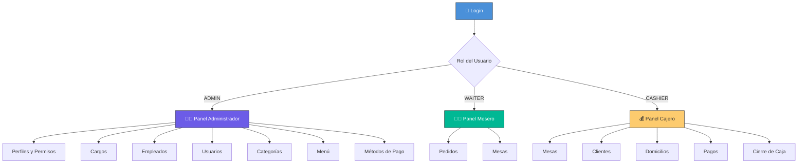

---

## 2. Requisitos e Instalación

### 2.1 Prerrequisitos

| Software       | Versión mínima |
|----------------|----------------|
| Java JDK       | 25+            |
| Node.js        | 18+            |
| npm            | 9+             |
| PostgreSQL     | 14+            |

### 2.2 Configuración de la Base de Datos

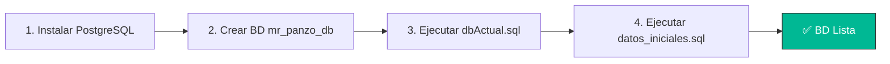

**Pasos en terminal:**

```bash
# 1. Crear la base de datos
psql -U postgres -c "CREATE DATABASE mr_panzo_db;"

# 2. Ejecutar el esquema
psql -U postgres -d mr_panzo_db -f backend/sql/dbActual.sql

# 3. Insertar datos iniciales (usuario admin)
psql -U postgres -d mr_panzo_db -f backend/sql/datos_iniciales.sql
```

### 2.3 Ejecutar el Sistema

```bash
# Desde la raíz del proyecto — inicia backend y frontend juntos:
npm run dev

# O por separado:
npm run backend      # Backend en http://localhost:8080
npm run frontend     # Frontend en http://localhost:5173
```

| Servicio  | URL                        |
|-----------|----------------------------|
| Frontend  | `http://localhost:5173`     |
| Backend   | `http://localhost:8080/api` |

---

## 3. Acceso al Sistema

### 3.1 Pantalla de Login

Al abrir la aplicación se muestra la pantalla de inicio de sesión:

- **Usuario inicial:** `admin`
- **Contraseña inicial:** `admin123`

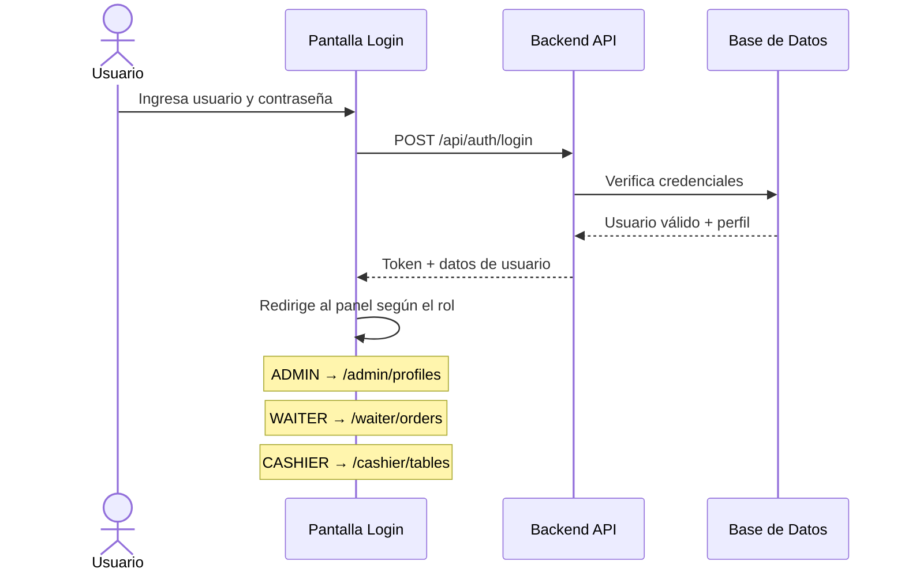

---

## 4. Roles y Permisos

El sistema implementa control de acceso basado en roles (RBAC). Cada usuario tiene un perfil con permisos específicos.

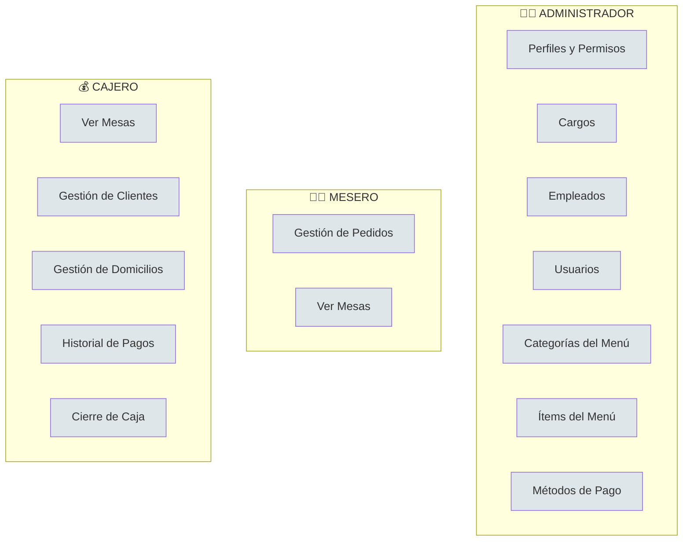

| Rol             | Acceso                                                                   |
|-----------------|--------------------------------------------------------------------------|
| **Administrador** | Configuración general: perfiles, cargos, empleados, usuarios, menú, categorías, métodos de pago |
| **Mesero**        | Crear y gestionar pedidos, ver mesas, realizar cobros                    |
| **Cajero**        | Clientes, domicilios, historial de pagos, cierre de caja, mesas         |

---

## 5. Módulo Administrador

### 5.1 Perfiles y Permisos

Permite crear roles personalizados y asignarles permisos granulares.

**Acciones disponibles:**
- ➕ Crear nuevo perfil
- ✏️ Editar perfil existente
- 🗑️ Eliminar perfil
- 🔐 Asignar/quitar permisos por módulo

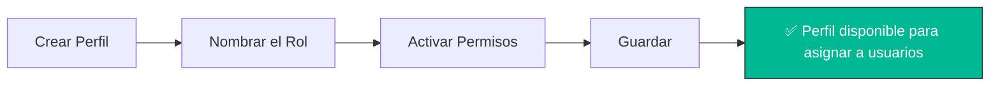

### 5.2 Cargos (Positions)

Gestiona los cargos laborales del restaurante (Mesero, Cajero, Chef, etc.).

**Acciones disponibles:**
- ➕ Crear cargo
- ✏️ Editar cargo
- 🔄 Activar/Desactivar cargo

### 5.3 Empleados

Administra la información del personal del restaurante.

**Campos del empleado:**
| Campo              | Descripción                        |
|--------------------|------------------------------------|
| Nombre y Apellido  | Datos personales                   |
| Documento          | Número de identificación           |
| Teléfono           | Número de contacto                 |
| Dirección          | Dirección del empleado             |
| Correo             | Email del empleado                 |
| Cargo              | Selección del cargo registrado     |
| Estado             | Activo / Inactivo                  |

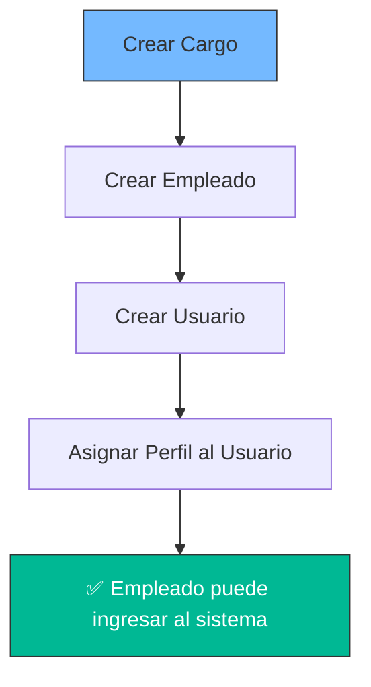

### 5.4 Usuarios

Crea cuentas de acceso al sistema para los empleados.

**Campos:**
- **Empleado:** Seleccionar empleado registrado
- **Username:** Nombre de usuario único
- **Contraseña:** Clave de acceso
- **Perfil:** Rol del sistema (Admin, Mesero, Cajero)

### 5.5 Categorías del Menú

Organiza los ítems del menú por categoría (Entradas, Platos Fuertes, Bebidas, Postres, etc.).

**Acciones:**
- ➕ Crear categoría
- ✏️ Editar nombre/descripción
- 🔄 Activar/Desactivar

### 5.6 Ítems del Menú

Gestiona los platos y productos disponibles para la venta.

**Campos del ítem:**
| Campo        | Descripción                           |
|--------------|---------------------------------------|
| Nombre       | Nombre del plato/producto             |
| Descripción  | Descripción detallada                 |
| Precio       | Precio de venta                       |
| Categoría    | Categoría a la que pertenece          |
| Disponible   | Si está disponible para ordenar       |

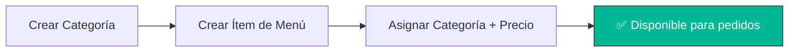

### 5.7 Métodos de Pago

Configura los métodos de pago aceptados en el restaurante.

**Tipos disponibles:**
- 💵 Efectivo
- 💳 Tarjeta de Crédito
- 💳 Tarjeta de Débito
- 📱 Transferencia
- 📦 Otro

---

## 6. Módulo Mesero

### 6.1 Gestión de Pedidos

Este es el módulo principal del mesero. Permite crear, editar y gestionar pedidos del restaurante.

#### Flujo para crear un pedido:

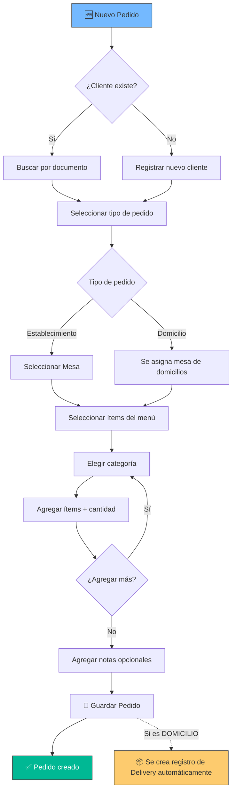

#### Tarjetas de Pedido

Cada pedido se muestra como una **tarjeta** con la siguiente información:
- 🔢 Número de pedido
- 🍽️ Mesa asignada (o 🏍️ Domicilio)
- 👤 Nombre del cliente
- 🛒 Lista de ítems con cantidades y subtotales
- 💵 Total del pedido
- 📝 Notas
- 🏷️ Badge de estado con color

#### Filtros de Estado

Se pueden filtrar los pedidos por estado usando los botones de filtro:

| Filtro          | Color    | Descripción                      |
|-----------------|----------|----------------------------------|
| 📋 Todos        | Gris     | Muestra todos los pedidos        |
| 🟡 Pendiente    | Amarillo | Pedidos recién creados           |
| 🔵 En Proceso   | Azul     | En preparación en cocina         |
| 🟢 Listo        | Verde    | Preparado, listo para servir     |
| ✅ Servido       | Primario | Entregado al cliente             |
| 🔴 Cancelado    | Rojo     | Pedidos cancelados               |

#### Estados de un Pedido

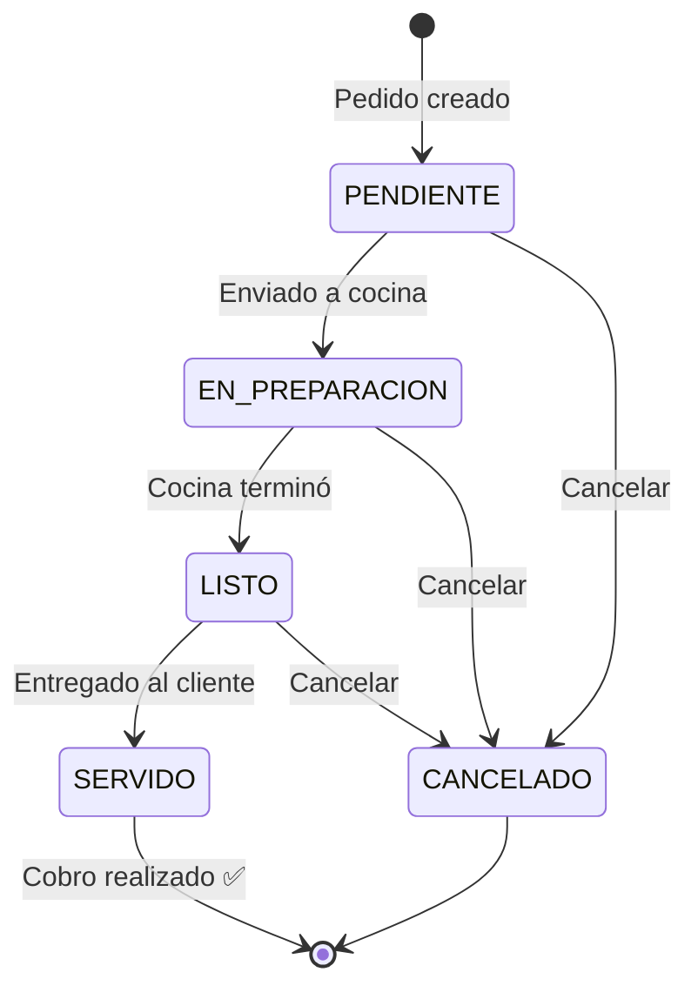

#### Realizar Cobro

Cuando un pedido tiene estado **SERVIDO**, aparece el botón **💰 Realizar Cobro**:

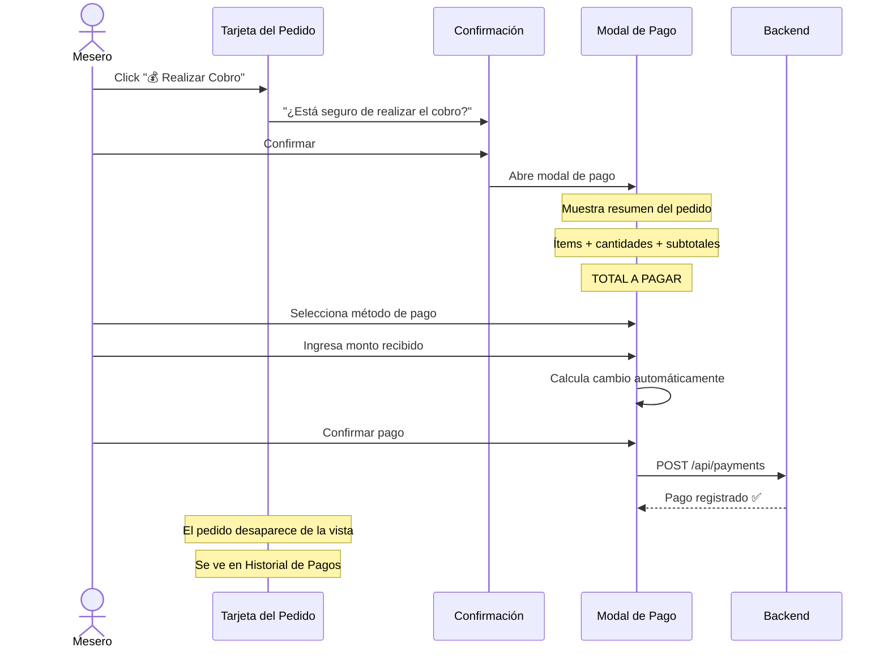

**Campos del modal de pago:**

| Campo             | Descripción                                    |
|-------------------|------------------------------------------------|
| Resumen del pedido | Cliente, tipo, detalle de ítems               |
| Total a pagar     | Monto total calculado                          |
| Método de pago    | Seleccionar (Efectivo, Tarjeta, etc.)          |
| Monto recibido    | Cantidad que entrega el cliente                |
| Cambio/Devuelta   | Se calcula automáticamente                     |

> ⚠️ **Nota:** Una vez cobrado, el pedido **desaparece** de la vista de pedidos y se mueve al historial de pagos del cajero.

### 6.2 Mesas (Vista Mesero)

Permite al mesero ver el estado de todas las mesas del restaurante.

| Estado       | Significado                   |
|--------------|-------------------------------|
| 🟢 Disponible | Mesa libre                   |
| 🔴 Ocupada    | Mesa con clientes            |
| 🟡 Reservada  | Mesa con reservación         |

---

## 7. Módulo Cajero

### 7.1 Mesas (Vista Cajero)

Vista de consulta del estado de las mesas del restaurante.

### 7.2 Clientes

Gestión completa de la base de datos de clientes.

**Campos del cliente:**
| Campo          | Descripción                    |
|----------------|--------------------------------|
| Nombre         | Nombre completo                |
| Identificación | Número de documento            |
| Teléfono       | Número de contacto             |
| Dirección      | Dirección del cliente          |
| Email          | Correo electrónico (opcional)  |

### 7.3 Gestión de Domicilios

Administra los pedidos de tipo **DOMICILIO**. Cuando un mesero crea un pedido tipo "Domicilio", automáticamente aparece aquí.

#### Estados de un Domicilio

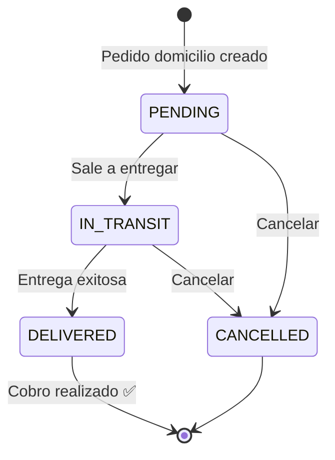

| Estado        | Badge         | Descripción                          |
|---------------|---------------|--------------------------------------|
| ⏳ Pendiente   | Amarillo      | Domicilio recién creado              |
| 🚀 En Tránsito | Azul          | Pedido en camino                     |
| ✅ Entregado   | Verde         | Entregado al cliente                 |
| ❌ Cancelado   | Rojo          | Domicilio cancelado                  |

#### Flujo de Domicilios

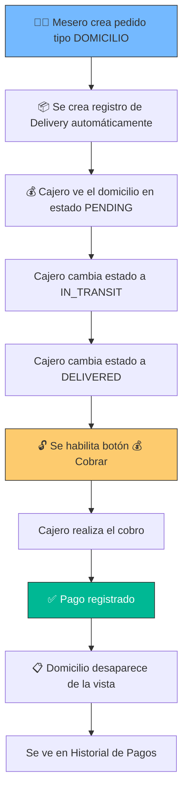

> ⚠️ **Importante:** El botón **💰 Cobrar** solo se habilita cuando el estado del domicilio es **ENTREGADO** (`DELIVERED`). Una vez cobrado, el domicilio desaparece de esta vista.

#### Tabla de Domicilios

| Columna          | Descripción                        |
|------------------|------------------------------------|
| ID               | Identificador del domicilio        |
| Pedido #         | Número del pedido asociado         |
| Cliente          | Nombre del cliente                 |
| Teléfono         | Teléfono de contacto               |
| Dirección        | Dirección de entrega               |
| Total Pedido     | Monto total del pedido             |
| Estado Domicilio | Estado actual del delivery         |
| Creado           | Fecha y hora de creación           |

**Acciones por domicilio:**
- 🔄 **Estado Domicilio** — Cambiar el estado del delivery
- 💰 **Cobrar** — Registrar pago (solo si estado = Entregado)

### 7.4 Historial de Pagos

Vista de **solo lectura** que muestra todos los pagos realizados.

**Información mostrada:**

| Columna        | Descripción                        |
|----------------|------------------------------------|
| ID             | Identificador del pago             |
| Orden          | Número de pedido asociado          |
| Monto          | Cantidad cobrada                   |
| Método de Pago | Efectivo, Tarjeta, etc.            |
| Estado         | Completado, Cancelado, etc.        |
| Fecha          | Fecha del pago                     |

**Funcionalidades adicionales:**
- 📊 Resumen diario (total ventas del día y cantidad de pagos)
- 📦 Botón **Cierre de Caja** — Genera el cierre diario

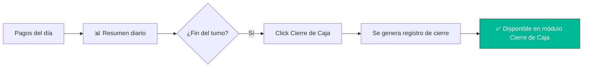

### 7.5 Cierre de Caja

Módulo para consultar los cierres de caja realizados.

#### Filtros por período

| Filtro     | Descripción                         |
|------------|-------------------------------------|
| 📋 Todos    | Muestra todos los cierres           |
| 📅 Diario   | Cierres del día actual              |
| 📆 Mensual  | Cierres del mes actual              |
| 📊 Anual    | Cierres del año actual              |

#### Información del cierre

| Campo             | Descripción                            |
|-------------------|----------------------------------------|
| Fecha de apertura | Inicio del período                     |
| Fecha de cierre   | Fin del período                        |
| Monto inicial     | Dinero al inicio                       |
| Monto final       | Dinero al cierre                       |
| Total ventas      | Suma de pagos completados              |
| Diferencia        | Diferencia entre esperado y real       |
| Cerrado por       | Usuario que realizó el cierre          |

**Funcionalidades:**
- 🔍 Ver detalle de cada cierre
- 📄 **Exportar PDF** — Genera un documento PDF del cierre seleccionado

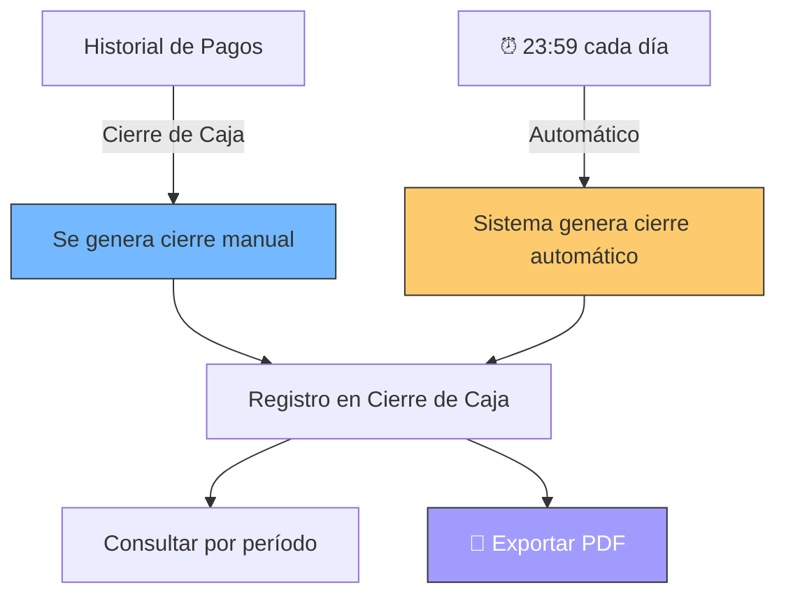

> 📌 **Cierre automático:** El sistema genera automáticamente un cierre de caja todos los días a las **23:59**. Si ya existe un cierre manual del mismo día, no se duplica.

---

## 8. Flujos Principales del Sistema

### 8.1 Flujo Completo: Pedido en Establecimiento

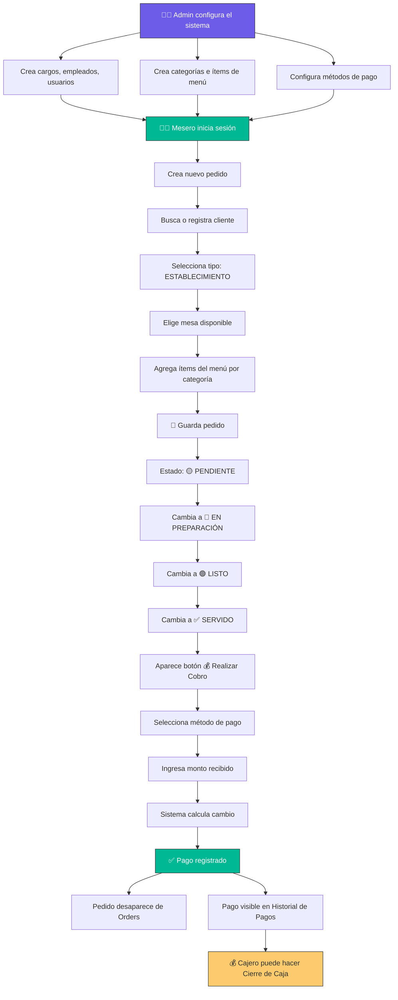

### 8.2 Flujo Completo: Pedido a Domicilio

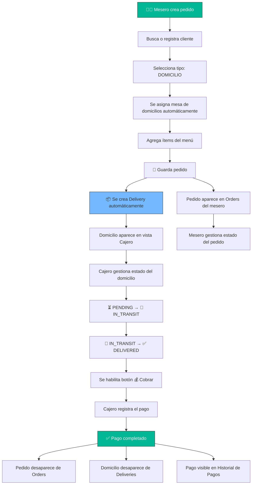

### 8.3 Flujo de Cierre de Caja

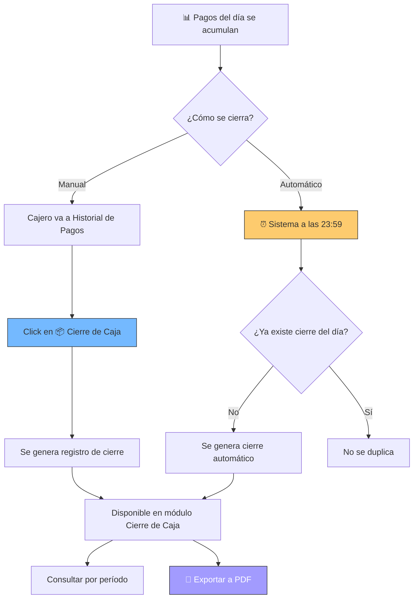

### 8.4 Configuración Inicial del Sistema

Flujo recomendado para configurar el sistema por primera vez:

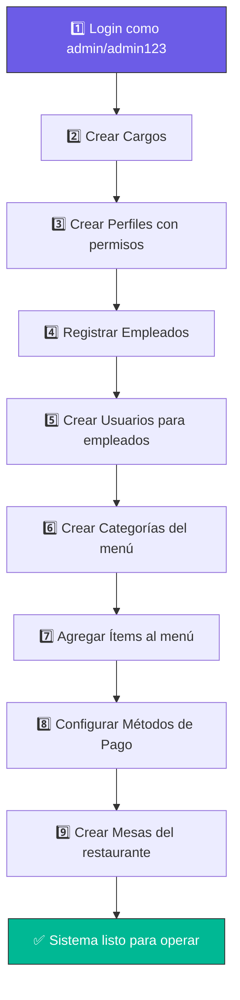

---

## 9. Preguntas Frecuentes

### ¿Cómo creo un nuevo mesero?

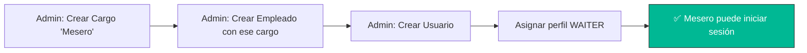

### ¿Por qué no aparece el botón de cobro?

| Situación                              | Solución                                                    |
|----------------------------------------|-------------------------------------------------------------|
| Pedido en establecimiento              | El pedido debe estar en estado **SERVIDO**                  |
| Pedido a domicilio                     | El estado del domicilio debe ser **ENTREGADO** (`DELIVERED`) |
| El pedido ya fue cobrado               | Ya no aparece en la vista, está en Historial de Pagos       |

### ¿Dónde veo los pedidos ya cobrados?

Los pedidos cobrados **desaparecen** de las vistas de Pedidos y Domicilios. Se pueden consultar en:
- **Cajero → Pagos** — Historial completo de pagos
- **Cajero → Cierre de Caja** — Resumen agrupado por período

### ¿Qué pasa si el sistema se cierra sin hacer cierre de caja?

El sistema genera un **cierre automático a las 23:59** todos los días. Si ya se hizo un cierre manual ese día, no se duplica.

### ¿Puedo cambiar el estado de un pedido hacia atrás?

Sí, el sistema permite cambiar el estado de un pedido a cualquier estado disponible. Sin embargo, se recomienda seguir el flujo natural:

`PENDIENTE → EN PREPARACIÓN → LISTO → SERVIDO`

### ¿Cómo cambio mi contraseña?

Contacte al administrador del sistema. El administrador puede editar las credenciales desde **Admin → Usuarios**.

---

## Arquitectura del Sistema

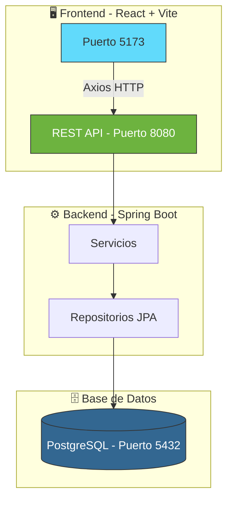

### Modelo de Datos Simplificado

```mermaid
erDiagram
    CARGO ||--o{ EMPLEADO : tiene
    EMPLEADO ||--o| USUARIO : tiene
    ROL ||--o{ USUARIO : asignado
    ROL }o--o{ PERMISOS : tiene
    
    CATEGORIA ||--o{ MENU : contiene
    CLIENTE ||--o{ PEDIDO : realiza
    USUARIO ||--o{ PEDIDO : registra
    MESA ||--o{ PEDIDO : asignada
    PEDIDO ||--o{ DETALLE_PEDIDO : contiene
    MENU ||--o{ DETALLE_PEDIDO : incluido
    
    PEDIDO ||--o| PAGO : genera
    METODO_PAGO ||--o{ PAGO : usa
    PEDIDO ||--o| DOMICILIO : genera
```

---

<div align="center">

**Mr. Panzo** — Sistema de Gestión de Restaurante  
Ingeniería de Software · 2026

</div>
