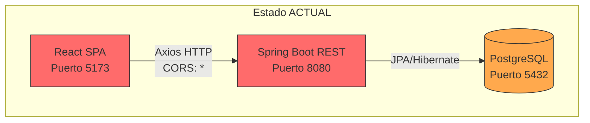
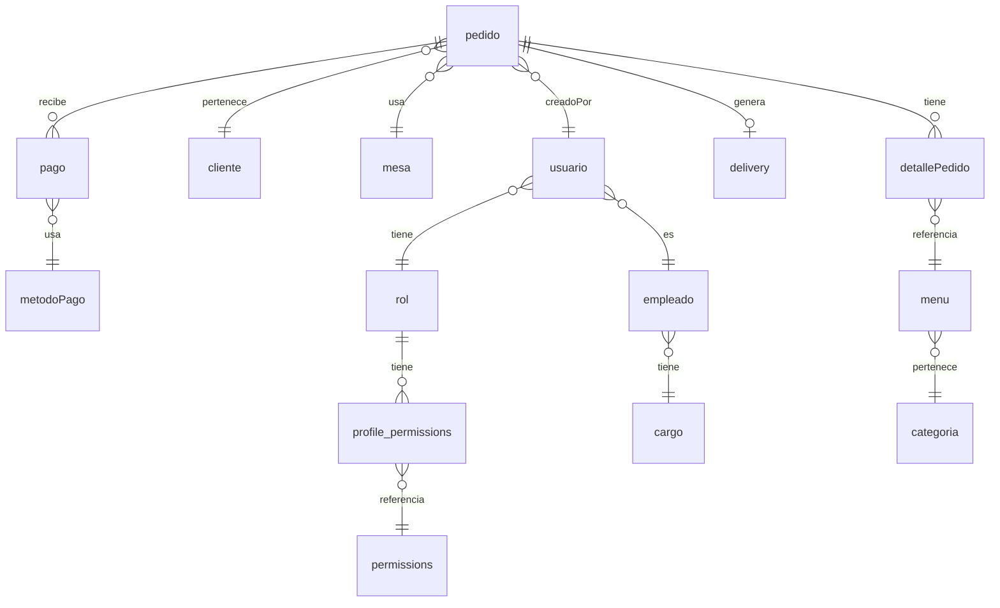
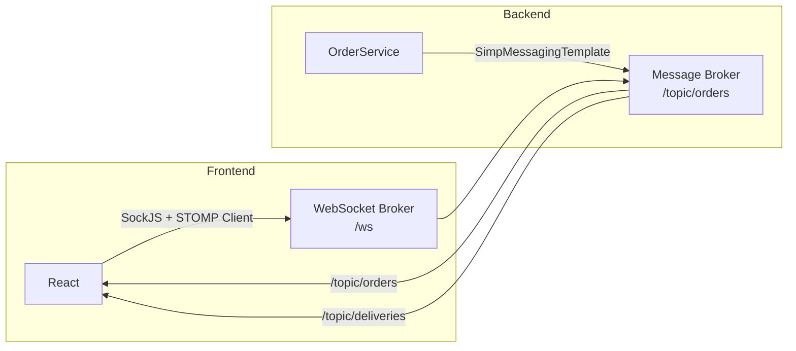

# 🔥 Auditoría Técnica — Mr. Panzo Restaurant System

> **Fecha:** 2026-04-22  
> **Stack:** Spring Boot 4.0.3 + React 19 + PostgreSQL 14+ + Vite 7  
> **Severidad Global:** 🔴 CRÍTICA — El sistema tiene vulnerabilidades de seguridad explotables AHORA MISMO.

---

## 1. ARQUITECTURA

### Diagnóstico: Monolito de 3 capas con acoplamiento fuerte



| Aspecto | Estado | Severidad |
|---------|--------|-----------|
| Tipo actual | Monolito en capas (Controller → Service → Repository) | ℹ️ Aceptable para el tamaño |
| Separación de capas | Existe pero NO se respetan límites | ⚠️ Media |
| Seguridad a nivel de transporte | CERO — No hay Spring Security | 🔴 Crítica |
| CORS | `allowedOriginPatterns: *` — ABIERTO A TODO INTERNET | 🔴 Crítica |
| Comunicación FE↔BE | REST sin contrato especificado (ni OpenAPI ni tipos compartidos) | ⚠️ Media |
| Escalabilidad | Queries sin paginación, sin caché, `findAll()` en todo | ⚠️ Media |

### Problemas concretos

1. **CORS completamente abierto** — [CorsConfig.java](file:///c:/Users/jhoni/OneDrive/Documentos/Desktop/SOFTWARE%20LA%20TERRAZA%20DEL%20SIN%C3%9A/Restaurante-LaTerrazaDelSin-/backend/src/main/java/com/restaurante/restaurantbackend/config/CorsConfig.java#L28): `config.setAllowedOriginPatterns(List.of("*"))`. Cualquier dominio puede hacer requests al backend.
2. **Sin API Gateway ni rate limiting** — Un atacante puede hacer brute force al login sin restricción.
3. **Sin contrato de API** — No hay Swagger/OpenAPI. Cada cambio en el backend es una bomba de tiempo para el frontend.

### Propuesta: Vertical Slicing + Clean Architecture Pragmática

Lo que tenés HOY (módulos por feature) es un **buen punto de partida**. No necesitás hexagonal completa ni microservicios. Lo que necesitás es:

```
modules/
  orders/
    api/           → Controllers + DTOs (capa de presentación)
    domain/        → Entities + Value Objects + Enums + Business Rules
    application/   → Use Cases / Services
    infrastructure/ → Repositories + External Services
```

Esto es Clean Architecture **pragmática**: respetás la inversión de dependencias sin crear 40 interfaces vacías.

---

## 2. BACKEND (Spring Boot)

### 2.1 🔴 Seguridad — CATASTRÓFICA

> [!CAUTION]
> Las contraseñas se almacenan y comparan EN TEXTO PLANO. No existe JWT. No existe Spring Security. No existe filtro de autenticación. CUALQUIER persona puede acceder DIRECTAMENTE a TODOS los endpoints de la API sin autenticarse.

#### Hallazgos en [AuthService.java](file:///c:/Users/jhoni/OneDrive/Documentos/Desktop/SOFTWARE%20LA%20TERRAZA%20DEL%20SIN%C3%9A/Restaurante-LaTerrazaDelSin-/backend/src/main/java/com/restaurante/restaurantbackend/modules/auth/service/AuthService.java):

```java
// Línea 60 — CONTRASEÑA EN TEXTO PLANO
if (!user.getPassword().equals(password)) { ... }

// Línea 87 — TOKEN FALSO (no es JWT, no es verificable, no expira de verdad)
String token = "Bearer_" + user.getId() + "_" + System.currentTimeMillis();
```

**El "token" es literalmente un string concatenado.** No hay firma, no hay claims, no hay expiración. Es equivalente a NO tener token.

#### Resultado: Cualquiera puede hacer esto

```bash
# Sin ningún token, TODOS los endpoints responden
curl http://localhost:8080/api/orders          # ✅ Lista TODOS los pedidos
curl http://localhost:8080/api/payments        # ✅ Lista TODOS los pagos
curl -X DELETE http://localhost:8080/api/orders/1  # ✅ BORRA un pedido
```

No existe `SecurityFilterChain`, no existe `@PreAuthorize`, no hay NADA.

#### Credenciales hardcodeadas en [application.properties](file:///c:/Users/jhoni/OneDrive/Documentos/Desktop/SOFTWARE%20LA%20TERRAZA%20DEL%20SIN%C3%9A/Restaurante-LaTerrazaDelSin-/backend/src/main/resources/application.properties#L7):

```properties
spring.datasource.password=${DB_PASSWORD:6509}  # ← Contraseña de la BD en texto plano como fallback
```

### 2.2 ⚠️ Manejo de errores — Frágil

[GlobalExceptionHandler.java](file:///c:/Users/jhoni/OneDrive/Documentos/Desktop/SOFTWARE%20LA%20TERRAZA%20DEL%20SIN%C3%9A/Restaurante-LaTerrazaDelSin-/backend/src/main/java/com/restaurante/restaurantbackend/config/GlobalExceptionHandler.java): Existe y es decente, PERO hay un problema grave: toda [RuntimeException](file:///c:/Users/jhoni/OneDrive/Documentos/Desktop/SOFTWARE%20LA%20TERRAZA%20DEL%20SIN%C3%9A/Restaurante-LaTerrazaDelSin-/backend/src/main/java/com/restaurante/restaurantbackend/config/GlobalExceptionHandler.java#25-41) se mapea a `400 BAD_REQUEST`. Un `NullPointerException` en el servidor devuelve `400` en vez de `500`, lo cual oculta bugs reales del servidor.

**Problema:** Todos los servicios lanzan [RuntimeException](file:///c:/Users/jhoni/OneDrive/Documentos/Desktop/SOFTWARE%20LA%20TERRAZA%20DEL%20SIN%C3%9A/Restaurante-LaTerrazaDelSin-/backend/src/main/java/com/restaurante/restaurantbackend/config/GlobalExceptionHandler.java#25-41) genérica en vez de excepciones de dominio propias:

```java
// Se repite en TODAS partes  
throw new RuntimeException("Order not found with id: " + id);   // ← Debería ser NotFoundException
throw new RuntimeException("Menu item is not available");       // ← Debería ser BusinessRuleException
throw new RuntimeException("User account is deactivated");     // ← Debería ser AuthenticationException
```

### 2.3 ⚠️ Modelos — Uso de `float` para dinero

> [!WARNING]
> Usar `float` o `Float` para valores monetarios causa **errores de redondeo silenciosos**. Un restaurante perdiendo centavos en cada transacción acumula pérdidas reales.

En [Order.java](file:///c:/Users/jhoni/OneDrive/Documentos/Desktop/SOFTWARE%20LA%20TERRAZA%20DEL%20SIN%C3%9A/Restaurante-LaTerrazaDelSin-/backend/src/main/java/com/restaurante/restaurantbackend/modules/orders/model/Order.java#L35) y [Payment.java](file:///c:/Users/jhoni/OneDrive/Documentos/Desktop/SOFTWARE%20LA%20TERRAZA%20DEL%20SIN%C3%9A/Restaurante-LaTerrazaDelSin-/backend/src/main/java/com/restaurante/restaurantbackend/modules/payments/model/Payment.java#L33):

```java
private Float totalAmount;  // ← NUNCA uses float para dinero
private Float amount;        // ← NUNCA
```

La BD también usa `REAL` (equivalente a `float4`). Se necesita migrar a `NUMERIC(10,2)` en BD y [BigDecimal](file:///c:/Users/jhoni/OneDrive/Documentos/Desktop/SOFTWARE%20LA%20TERRAZA%20DEL%20SIN%C3%9A/Restaurante-LaTerrazaDelSin-/backend/src/main/java/com/restaurante/restaurantbackend/modules/payments/model/Payment.java#58-62) en Java.

### 2.4 ⚠️ Timestamps falsos

En [Order.java](file:///c:/Users/jhoni/OneDrive/Documentos/Desktop/SOFTWARE%20LA%20TERRAZA%20DEL%20SIN%C3%9A/Restaurante-LaTerrazaDelSin-/backend/src/main/java/com/restaurante/restaurantbackend/modules/orders/model/Order.java) líneas 54-58:

```java
@Transient
private LocalDateTime createdAt;   // ← @Transient = NO SE PERSISTE EN BD

@Transient
private LocalDateTime updatedAt;   // ← Siempre serán null al leer de BD
```

Estas fechas se declaran pero NUNCA se guardan ni recuperan. La tabla `pedido` no tiene columnas de timestamp.

### 2.5 Lógica de negocio: pedidos y pagos

| Problema | Ubicación | Severidad |
|----------|-----------|-----------|
| No se valida que una orden NO tenga ya un pago antes de crear otro | [PaymentService](file:///c:/Users/jhoni/OneDrive/Documentos/Desktop/SOFTWARE%20LA%20TERRAZA%20DEL%20SIN%C3%9A/Restaurante-LaTerrazaDelSin-/backend/src/main/java/com/restaurante/restaurantbackend/modules/payments/service/PaymentService.java#L41) | 🔴 |
| No se valida si la caja está cerrada antes de aceptar pagos | PaymentService | 🔴 |
| [deleteOrder](file:///c:/Users/jhoni/OneDrive/Documentos/Desktop/SOFTWARE%20LA%20TERRAZA%20DEL%20SIN%C3%9A/Restaurante-LaTerrazaDelSin-/backend/src/main/java/com/restaurante/restaurantbackend/modules/orders/service/OrderService.java#284-289) elimina un pedido sin verificar si tiene pagos asociados | OrderService L284 | ⚠️ |
| Scheduler usa `System.out.println` en vez del Logger | [CashRegisterScheduler.java](file:///c:/Users/jhoni/OneDrive/Documentos/Desktop/SOFTWARE%20LA%20TERRAZA%20DEL%20SIN%C3%9A/Restaurante-LaTerrazaDelSin-/backend/src/main/java/com/restaurante/restaurantbackend/modules/cashregister/service/CashRegisterScheduler.java#L23) | ⚠️ |
| Status de pedido como `String` de 1 char en BD ("P","E","L","S","C") con conversión manual a enum | Order.java | ⚠️ |
| [OrderService](file:///c:/Users/jhoni/OneDrive/Documentos/Desktop/SOFTWARE%20LA%20TERRAZA%20DEL%20SIN%C3%9A/Restaurante-LaTerrazaDelSin-/backend/src/main/java/com/restaurante/restaurantbackend/modules/orders/service/OrderService.java#27-326) depende directamente de `DeliveryService` (acoplamiento entre módulos) | OrderService L39 | ⚠️ |

### 2.6 Propuesta de refactor backend

1. **Agregar Spring Security + JWT REAL** — `spring-boot-starter-security` + `jjwt`
2. **BCrypt para passwords** — `PasswordEncoder` de Spring
3. **Excepciones de dominio** — `OrderNotFoundException extends ResponseStatusException`
4. **BigDecimal para dinero** — En TODA la cadena (BD → Entity → DTO → Response)
5. **Paginación en todas las queries** — `Pageable` + `Page<T>`
6. **Validación con Bean Validation** — `@NotNull`, `@Positive`, `@Size` en DTOs
7. **MapStruct para mapeos** — En vez de los [mapToResponse()](file:///c:/Users/jhoni/OneDrive/Documentos/Desktop/SOFTWARE%20LA%20TERRAZA%20DEL%20SIN%C3%9A/Restaurante-LaTerrazaDelSin-/backend/src/main/java/com/restaurante/restaurantbackend/modules/orders/service/OrderService.java#290-314) manuales

---

## 3. FRONTEND (React JSX)

### 3.1 🔴 Sin TypeScript

El proyecto no usa TypeScript a pesar de tener `@types/react` y `@types/react-dom` instalados. Es como tener el casco de moto en la mano mientras manejas a 120km/h.

**Consecuencias observadas:**
- Props sin validación de tipos en NINGÚN componente
- Typos en nombres de propiedades que se descubren en runtime
- Refactoring de la API del backend es una lotería — no sabés qué se rompe

### 3.2 🔴 Componentes monstruo

[Orders.jsx](file:///c:/Users/jhoni/OneDrive/Documentos/Desktop/SOFTWARE%20LA%20TERRAZA%20DEL%20SIN%C3%9A/Restaurante-LaTerrazaDelSin-/frontend/src/pages/waiter/Orders.jsx) tiene **1524 líneas**. Un solo archivo con:

- 18 variables de estado (`useState`)
- Lógica de búsqueda de clientes
- Creación de clientes inline
- Lógica de pedidos
- Lógica de pagos
- Lógica de filtros
- Todo el rendering JSX

Esto NO es un componente, es un **archivo-dios**. Es imposible de testear, imposible de mantener, imposible de entender.

### 3.3 ⚠️ Inline styles por todos lados

```jsx
// Orders.jsx — Esto se repite CIENTOS de veces
<div style={{
  padding: '6px 14px',
  border: statusFilter === opt.value ? `2px solid ${opt.color}` : '1px solid #dee2e6',
  borderRadius: '20px',
  backgroundColor: statusFilter === opt.value ? `${opt.color}20` : 'white',
  // ...15 propiedades más
}}>
```

Tenés TailwindCSS v4 instalado y NO LO USÁS. Tenés shadcn configurado y apenas usás [button.jsx](file:///c:/Users/jhoni/OneDrive/Documentos/Desktop/SOFTWARE%20LA%20TERRAZA%20DEL%20SIN%C3%9A/Restaurante-LaTerrazaDelSin-/frontend/src/components/ui/button.jsx). El 90% del styling es inline.

### 3.4 ⚠️ Seguridad solo en el cliente

[ProtectedRoute.jsx](file:///c:/Users/jhoni/OneDrive/Documentos/Desktop/SOFTWARE%20LA%20TERRAZA%20DEL%20SIN%C3%9A/Restaurante-LaTerrazaDelSin-/frontend/src/components/layout/ProtectedRoute.jsx): La protección de rutas solo existe en el frontend. El backend no valida NADA. Cualquiera puede bypass-ear la autenticación haciendo curl al API directamente.

### 3.5 ⚠️ Manejo de estado limitado

- Solo existe `AuthContext` — No hay estado global para pedidos, menú ni nada
- Cada página hace [loadData()](file:///c:/Users/jhoni/OneDrive/Documentos/Desktop/SOFTWARE%20LA%20TERRAZA%20DEL%20SIN%C3%9A/Restaurante-LaTerrazaDelSin-/frontend/src/pages/waiter/Orders.jsx#77-116) con `useEffect` y guarda TODO en `useState` local
- No hay caché, no hay optimistic updates, no hay invalidación de queries
- Se usa `alert()` de JavaScript nativo para TODAS las notificaciones — 0 UX

### 3.6 Propuesta de migración a TypeScript — Paso a paso

| Fase | Duración | Qué hacer |
|------|----------|-----------|
| **1. Setup** | 1 día | `tsconfig.json`, renombrar [main.jsx](file:///c:/Users/jhoni/OneDrive/Documentos/Desktop/SOFTWARE%20LA%20TERRAZA%20DEL%20SIN%C3%9A/Restaurante-LaTerrazaDelSin-/frontend/src/main.jsx) → `main.tsx`, [App.jsx](file:///c:/Users/jhoni/OneDrive/Documentos/Desktop/SOFTWARE%20LA%20TERRAZA%20DEL%20SIN%C3%9A/Restaurante-LaTerrazaDelSin-/frontend/src/App.jsx) → `App.tsx` |
| **2. Tipos base** | 2 días | Crear `types/` con interfaces: [Order](file:///c:/Users/jhoni/OneDrive/Documentos/Desktop/SOFTWARE%20LA%20TERRAZA%20DEL%20SIN%C3%9A/Restaurante-LaTerrazaDelSin-/backend/src/main/java/com/restaurante/restaurantbackend/modules/orders/model/Order.java#14-111), [Payment](file:///c:/Users/jhoni/OneDrive/Documentos/Desktop/SOFTWARE%20LA%20TERRAZA%20DEL%20SIN%C3%9A/Restaurante-LaTerrazaDelSin-/backend/src/main/java/com/restaurante/restaurantbackend/modules/payments/model/Payment.java#12-74), [User](file:///c:/Users/jhoni/OneDrive/Documentos/Desktop/SOFTWARE%20LA%20TERRAZA%20DEL%20SIN%C3%9A/Restaurante-LaTerrazaDelSin-/backend/src/main/java/com/restaurante/restaurantbackend/modules/auth/service/AuthService.java#138-144), [MenuItem](file:///c:/Users/jhoni/OneDrive/Documentos/Desktop/SOFTWARE%20LA%20TERRAZA%20DEL%20SIN%C3%9A/Restaurante-LaTerrazaDelSin-/frontend/src/pages/waiter/Orders.jsx#512-516), etc. |
| **3. Services** | 2 días | Migrar `services/*.js` → `services/*.ts` con tipos de retorno definidos |
| **4. Context** | 1 día | [AuthContext.jsx](file:///c:/Users/jhoni/OneDrive/Documentos/Desktop/SOFTWARE%20LA%20TERRAZA%20DEL%20SIN%C3%9A/Restaurante-LaTerrazaDelSin-/frontend/src/context/AuthContext.jsx) → `AuthContext.tsx` con `AuthContextType` |
| **5. Components** | 3 días | Migrar `components/common/*.jsx` con `Props` interfaces |
| **6. Pages** | 5 días | Migrar las 15 páginas una a la vez, empezando por las más simples (`admin/Positions`) |

**Regla:** NUNCA migrar más de 3 archivos en un PR. Cada migración debe compilar y funcionar.

---

## 4. BASE DE DATOS (PostgreSQL)

### 4.1 Modelo de datos actual



### 4.2 Problemas de integridad

| Problema | Tabla | Severidad |
|----------|-------|-----------|
| **Columna `"valor a pagar"` con ESPACIOS** — fuerza backticks en JPA | `pedido` | ⚠️ |
| **Columna `"Id_pedido"` con capitalización inconsistente** | `pago` | ⚠️ |
| **Tabla `"menú"` con tilde** — causa problemas de encoding | `menú` | ⚠️ |
| **Tabla `"metodoPago"` con camelCase en SQL** | `metodoPago` | ⚠️ |
| **`REAL` para dinero** en `pedido.valor a pagar`, `pago.monto`, `detallePedido.precio_unitario`, `menú.precio` | Todas | 🔴 |
| **No hay `created_at` ni `updated_at`** en `pedido`, `pago`, `detallePedido` | Core tables | ⚠️ |
| **Sin constraint UNIQUE** en `pago` para evitar pagos duplicados por pedido | `pago` | 🔴 |
| **Sin CHECK constraint** en `pedido.estado` — acepta cualquier string | `pedido` | ⚠️ |
| **Tabla `detallePedido` sin PRIMARY KEY explícita** | `detallePedido` | 🔴 |
| **Sin índices en columnas de FK** de `pedido`, `pago`, `detallePedido` (excepto delivery y empleado) | Varias | ⚠️ |
| **Mezcla de idiomas:** `cargo`, `cliente`, `mesa` (español) + `permissions`, `delivery`, `cash_register_closes` (inglés) | Todas | ⚠️ |
| **`usuario.contraseña`** columna con tilde Y contraseñas en texto plano | `usuario` | 🔴 |
| **`contraseña VARCHAR(30)`** — Imposible almacenar un hash BCrypt (60 chars) | `usuario` | 🔴 |

### 4.3 Propuesta de mejoras

1. **Renombrar columnas** — Eliminar tildes, espacios, camelCase. Usar `snake_case` consistente
2. **Migrar `REAL` a `NUMERIC(10,2)`** en todas las columnas monetarias
3. **Agregar `created_at` + `updated_at`** con defaults y triggers
4. **Agregar PK compuesta** a `detallePedido`: `PRIMARY KEY (id_pedido, id_menu)`
5. **Agregar CHECK constraints** para status: `CHECK (estado IN ('P','E','L','S','C'))`
6. **Agregar UNIQUE constraint** en pago: `UNIQUE (id_pedido)` para evitar pagos duplicados
7. **Ampliar `contraseña`** a `VARCHAR(255)` para almacenar hashes BCrypt
8. **Usar Flyway o Liquibase** para versionar migraciones — NO scripts SQL sueltos

---

## 5. TIEMPO REAL (WebSockets)

### Estado actual: NO EXISTE

El README menciona "MANEJARLO CON WEBSOCKET EN TIEMPO REAL LOS PEDIDOS" pero no hay implementación alguna.

### Propuesta: Spring WebSocket + STOMP

Para este stack (Spring Boot + React), la opción natural es:

```
spring-boot-starter-websocket  +  SockJS  +  STOMP
```

NO uses Socket.io — eso es para Node.js. En Spring Boot la solución nativa es WebSocket + STOMP.

#### Arquitectura propuesta



#### Canales recomendados

| Canal | Eventos | Consumidores |
|-------|---------|--------------|
| `/topic/orders` | Nuevo pedido, cambio de estado | Meseros, Cocina |
| `/topic/deliveries` | Nuevo delivery, estado delivery | Cajeros |
| `/topic/tables` | Mesa ocupada/liberada | Todos |
| `/topic/payments` | Nuevo pago registrado | Cajeros |

---

## 6. DEVOPS Y CALIDAD

### 6.1 Testing — CERO

Solo existe [RestaurantBackendApplicationTests.java](file:///c:/Users/jhoni/OneDrive/Documentos/Desktop/SOFTWARE%20LA%20TERRAZA%20DEL%20SIN%C3%9A/Restaurante-LaTerrazaDelSin-/backend/src/test/java/com/restaurante/restaurant_backend/RestaurantBackendApplicationTests.java) con el test vacío de Spring Boot generado automáticamente:

```java
@Test
void contextLoads() {
}  // ← Esto NO es testing
```

**Frontend:** CERO tests. No hay Vitest, no hay Testing Library, no hay Cypress, NADA.

### 6.2 Logging

- Backend: `SLF4J` + `Logback` (viene con Spring Boot) — Se usa en [AuthService](file:///c:/Users/jhoni/OneDrive/Documentos/Desktop/SOFTWARE%20LA%20TERRAZA%20DEL%20SIN%C3%9A/Restaurante-LaTerrazaDelSin-/backend/src/main/java/com/restaurante/restaurantbackend/modules/auth/service/AuthService.java#13-145) y [OrderService](file:///c:/Users/jhoni/OneDrive/Documentos/Desktop/SOFTWARE%20LA%20TERRAZA%20DEL%20SIN%C3%9A/Restaurante-LaTerrazaDelSin-/backend/src/main/java/com/restaurante/restaurantbackend/modules/orders/service/OrderService.java#27-326). ✅ Aceptable.
- Excepción: [CashRegisterScheduler](file:///c:/Users/jhoni/OneDrive/Documentos/Desktop/SOFTWARE%20LA%20TERRAZA%20DEL%20SIN%C3%9A/Restaurante-LaTerrazaDelSin-/backend/src/main/java/com/restaurante/restaurantbackend/modules/cashregister/service/CashRegisterScheduler.java#6-30) usa `System.out.println` ❌
- Frontend: `console.error` y `console.log` dispersos ❌

### 6.3 Variables de entorno

Parcialmente implementado con fallbacks peligrosos:

```properties
spring.datasource.url=${DB_URL:jdbc:postgresql://localhost:5432/mr_panzo_db}
spring.datasource.password=${DB_PASSWORD:6509}  # ← Fallback = contraseña real
```

Los fallbacks NUNCA deben ser las credenciales reales. Deben fallar ruidosamente si la variable no existe.

### 6.4 CI/CD — NO EXISTE

- No hay `Dockerfile`
- No hay `docker-compose.yml`
- No hay `.github/workflows/`
- No hay pipeline de ningún tipo
- Se despliega manualmente con [.bat](file:///c:/Users/jhoni/OneDrive/Documentos/Desktop/SOFTWARE%20LA%20TERRAZA%20DEL%20SIN%C3%9A/Restaurante-LaTerrazaDelSin-/start-backend.bat) files

### 6.5 Propuesta de calidad mínima

| Herramienta | Propósito |
|-------------|-----------|
| **JUnit 5 + Mockito** | Tests unitarios backend (services) |
| **Testcontainers** | Tests de integración con PostgreSQL real |
| **Vitest + React Testing Library** | Tests frontend |
| **Playwright** | Tests E2E |
| **Docker Compose** | Ambiente de desarrollo reproducible |
| **GitHub Actions** | CI/CD pipeline |
| **SonarQube** | Análisis estático de código |

---

## 7. DEUDA TÉCNICA — Lista priorizada

| # | Prioridad | Problema | Impacto | Esfuerzo |
|---|-----------|----------|---------|----------|
| 1 | 🔴 P0 | Contraseñas en texto plano + sin Spring Security | **Seguridad** — explotable ahora | 3-5 días |
| 2 | 🔴 P0 | API completamente abierta (sin autenticación en endpoints) | **Seguridad** — cualquiera accede a todo | Incluido en #1 |
| 3 | 🔴 P0 | CORS abierto a `*` | **Seguridad** — CSRF, data leak | 30 min |
| 4 | 🔴 P1 | `float`/`REAL` para dinero en toda la cadena | **Integridad de datos** — pérdida de centavos | 2-3 días |
| 5 | 🔴 P1 | Pago duplicado posible (sin UNIQUE constraint ni validación) | **Integridad financiera** | 1 día |
| 6 | ⚠️ P2 | [Orders.jsx](file:///c:/Users/jhoni/OneDrive/Documentos/Desktop/SOFTWARE%20LA%20TERRAZA%20DEL%20SIN%C3%9A/Restaurante-LaTerrazaDelSin-/frontend/src/pages/waiter/Orders.jsx) con 1524 líneas (archivo-dios) | **Mantenibilidad** | 3-4 días |
| 7 | ⚠️ P2 | Sin TypeScript (bugs en runtime por tipos incorrectos) | **Productividad + Calidad** | 2 semanas |
| 8 | ⚠️ P2 | Cero tests en toda la aplicación | **Confiabilidad** | Continuo |
| 9 | ⚠️ P2 | Excepciones genéricas ([RuntimeException](file:///c:/Users/jhoni/OneDrive/Documentos/Desktop/SOFTWARE%20LA%20TERRAZA%20DEL%20SIN%C3%9A/Restaurante-LaTerrazaDelSin-/backend/src/main/java/com/restaurante/restaurantbackend/config/GlobalExceptionHandler.java#25-41) para todo) | **Debugging + UX** | 2-3 días |
| 10 | ⚠️ P3 | Esquema de BD con nombres inconsistentes (tildes, espacios, mezcla idiomas) | **Mantenibilidad** | 2-3 días |
| 11 | ⚠️ P3 | Timestamps `@Transient` (nunca se persisten) | **Auditoría** | 1 día |
| 12 | ℹ️ P4 | Sin paginación en queries | **Performance** | 2-3 días |
| 13 | ℹ️ P4 | Sin WebSockets para tiempo real | **UX** | 3-5 días |
| 14 | ℹ️ P4 | Sin CI/CD ni Docker | **DevOps** | 2-3 días |

---

## 8. ROADMAP NIVEL SENIOR

### Fase 1 — Seguridad (Semana 1-2)

```
URGENTE — Sin esto, el sistema NO debería estar en producción
```

- [ ] Implementar Spring Security + JWT (con `jjwt-api`)
- [ ] BCrypt para contraseñas (`PasswordEncoder`)
- [ ] `SecurityFilterChain` con rutas protegidas
- [ ] Restringir CORS a dominios específicos
- [ ] Eliminar password hardcodeado de [application.properties](file:///c:/Users/jhoni/OneDrive/Documentos/Desktop/SOFTWARE%20LA%20TERRAZA%20DEL%20SIN%C3%9A/Restaurante-LaTerrazaDelSin-/backend/src/main/resources/application.properties)

### Fase 2 — Integridad de datos (Semana 3)

- [ ] Migrar `REAL` → `NUMERIC(10,2)` en BD
- [ ] Migrar `Float` → [BigDecimal](file:///c:/Users/jhoni/OneDrive/Documentos/Desktop/SOFTWARE%20LA%20TERRAZA%20DEL%20SIN%C3%9A/Restaurante-LaTerrazaDelSin-/backend/src/main/java/com/restaurante/restaurantbackend/modules/payments/model/Payment.java#58-62) en entities
- [ ] Agregar constraint UNIQUE en pagos
- [ ] Agregar `created_at` / `updated_at` en tablas core
- [ ] Renombrar columnas problemáticas (tildes, espacios)

### Fase 3 — Calidad de código (Semana 4-5)

- [ ] Crear excepciones de dominio (`NotFoundException`, `BusinessException`)
- [ ] Refactorizar [Orders.jsx](file:///c:/Users/jhoni/OneDrive/Documentos/Desktop/SOFTWARE%20LA%20TERRAZA%20DEL%20SIN%C3%9A/Restaurante-LaTerrazaDelSin-/frontend/src/pages/waiter/Orders.jsx) en componentes: `OrderCard`, `OrderForm`, `PaymentModal`, `OrderFilters`, `useOrders` hook
- [ ] Iniciar migración a TypeScript (services + context primero)
- [ ] Configurar Vitest + primeros tests

### Fase 4 — Features profesionales (Semana 6-8)

- [ ] WebSockets con STOMP para pedidos en tiempo real
- [ ] Paginación en todas las queries del backend
- [ ] Toast notifications (reemplazar `alert()`)
- [ ] React Query / TanStack Query para caché + invalidación
- [ ] Docker Compose para desarrollo

### Tecnologías que debés aprender

| Tecnología | Para qué | Prioridad |
|------------|----------|-----------|
| **Spring Security** | Auth real con JWT | 🔴 Ya |
| **TypeScript** | Tipado estático en frontend | 🔴 Ya |
| **Docker / Docker Compose** | Ambientes reproducibles | ⚠️ Pronto |
| **WebSocket + STOMP** | Tiempo real | ⚠️ Pronto |
| **TanStack Query** | Server state management | ⚠️ Pronto |
| **Vitest + RTL** | Testing frontend | ⚠️ Pronto |
| **JUnit 5 + Mockito** | Testing backend | ⚠️ Pronto |
| **Flyway o Liquibase** | Migraciones de BD | ℹ️ Después |
| **GitHub Actions** | CI/CD | ℹ️ Después |
| **MapStruct** | Entity ↔ DTO mapping | ℹ️ Después |

---

## Resumen ejecutivo

Este sistema tiene las **funcionalidades correctas** para un MVP de restaurante. La lógica de negocio (pedidos, pagos, domicilios, cierre de caja) está razonablemente bien pensada. La estructura de módulos por feature en el backend es un buen punto de partida.

Sin embargo, tiene **3 problemas categóricamente inaceptables** para producción:

1. 🔴 **Contraseñas en texto plano** + **API sin autenticación** = hackeable en 30 segundos
2. 🔴 **`float` para dinero** = pérdida acumulativa de centavos  
3. 🔴 **Sin pagos únicos por pedido** = datos financieros corruptos

La buena noticia: todo es reparable. Empezá por seguridad, seguí por integridad de datos, terminá con calidad de código. No intentes arreglar todo al mismo tiempo — priorizá por impacto y riesgo.

> *Un sistema que funciona pero no es seguro, no funciona.* — Cualquier arquitecto de software que se respete.
